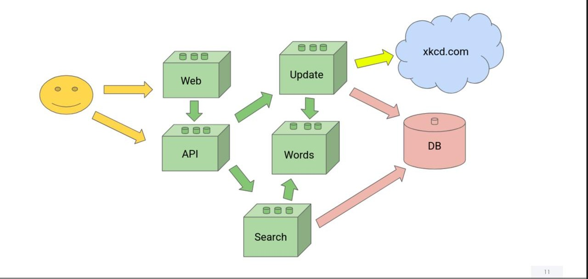

# XKCD Comics Search Microservices System

## Проект: Поисковая система комиксов XKCD

**Микросервисная архитектура** для поиска, хранения и обновления коллекции комиксов XKCD с возможностью поиска и автоматического обновления базы.

### Основные компоненты:

1. **API Gateway**  
   Единая точка входа для всех запросов с функциями:
   - Маршрутизации
   - Аутентификации (JWT)
   - Ограничения запросов
   - Балансировки нагрузки

2. **Search Service**  
   Полнотекстовый поиск по комиксам с:
   - Поиском по ключевым словам

3. **Update Service**  
   Автоматическое обновление базы:
   - Проверка новых комиксов
   - Дельта-обновления (только новые данные)

4. **Words Service**  
   Обработка и стандартизация данных:
   - Нормализация поисковых фраз
   - Нормализация описаний комиксов

5. **BFF (Backend for Frontend)**  
   Адаптер для клиентских приложений

### Особенности системы:
- Автоматическое поддержание актуальной базы
- Быстрый полнотекстовый поиск
- Гибкое API для интеграции
- Масштабируемая архитектура
- Поддержка веб-клиентов